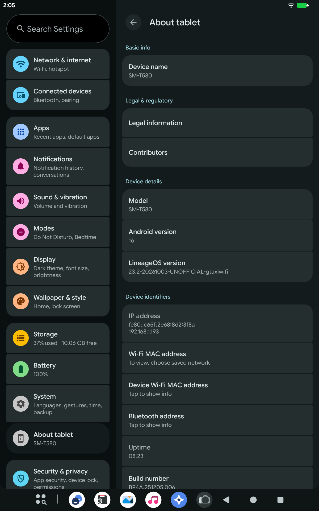

# LineageOS 23.2 for the Galaxy Tab A 10.1 (2016) Wi-Fi (SM-T580)

An unofficial LineageOS 23.2 port for the Samsung SM-T580 (`gtaxlwifi`,
Exynos 7870), on a mainline Linux kernel (7.2) with a series of patches
for this board.

  
  

- **Install**: [`docs/INSTALL.md`](docs/INSTALL.md)
- **Build**: [`docs/SETUP.md`](docs/SETUP.md)

| repository | what |
|---|---|
| [android_device_samsung_gtaxlwifi](https://github.com/alessandro-fontana/android_device_samsung_gtaxlwifi) | the device tree |
| [linux-exynos7870](https://github.com/alessandro-fontana/linux-exynos7870) | the kernel: Linux 7.2.9 and this board's commits |
| this repository | changes to other projects (`patches/`), release tools (`tools/`), instructions, releases |

One branch per LineageOS release, as in LineageOS's own repositories:
`lineage-23.2` builds with a `lineage-23.2` tree.

## AI assistance

This port was developed with the help of an LLM coding assistant. Every
commit made with it carries the trailer `Assisted-by: LLM`, as the
LineageOS [AI coding assistants guidelines](https://github.com/LineageOS/charter/blob/main/ai-coding-assistants.md)
require; the code was built and tested on the author's own SM-T580, and
the author is responsible for it.

## What works

Display, touchscreen and the capacitive keys; GPU (Panfrost); Wi-Fi,
hotspot and Wi-Fi Direct; Bluetooth; GPS; audio (speaker, headphones,
Bluetooth) and the internal microphone; both cameras, photos and video;
hardware video decoding and encoding (H.264, HEVC, VP8, MPEG-4, H.263);
accelerometer, light sensor and the magnetic cover; microSD, also as
adoptable storage; USB (MTP, adb, tethering); charging, also with the
tablet off; file-based encryption; SELinux enforcing; updates through
LineageOS Recovery.

Not working: the microphone of a wired headset.

## Licensing

The kernel and the loader are GPL-2.0. Everything else is Apache-2.0
unless a file says otherwise. Proprietary files are not in these
repositories: the device tree's `extract-files.py` fetches them, see
SETUP.md.
